# Visual reference gallery

These references accompany the [proposal](../proposal.md) and [implementation design](../design.md). Colors are neutral placeholders. They do not select or change a theme palette.

## Combined target compositions

The following screenshots combine dense frost, compact rows, Segoe UI, icon-and-underline navigation, and soft-rounded controls. They were captured from browser mockups on 2026-10-05. They show expanded compositions so all relevant groups are visible; the implemented default-size window must use the specified scrolling layout. They do not prove native Windows blur, Avalonia rendering, or minimum-size acceptance.

### General: compact sections

Startup, Window, and Break reminders use aligned rows and restrained dividers. General does not put every section or individual setting in a card. OK, Apply, and Cancel retain their current behavior.

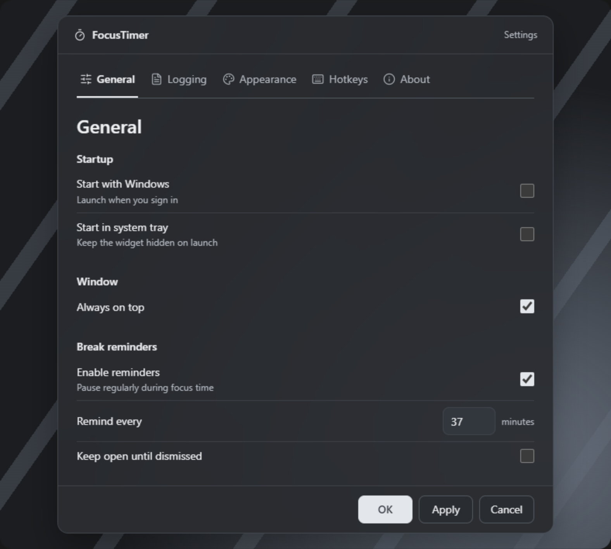

### Appearance: two useful peer cards

Theme tools sit above Widget layout and Widget opacity. Compact rows and labeled slider values sit inside the two peer cards. Palette editing and existing opacity diagnostics remain available below. The widget background selector retains Off/Solid; frost is proposed for the desktop window shell, not as a new widget option.

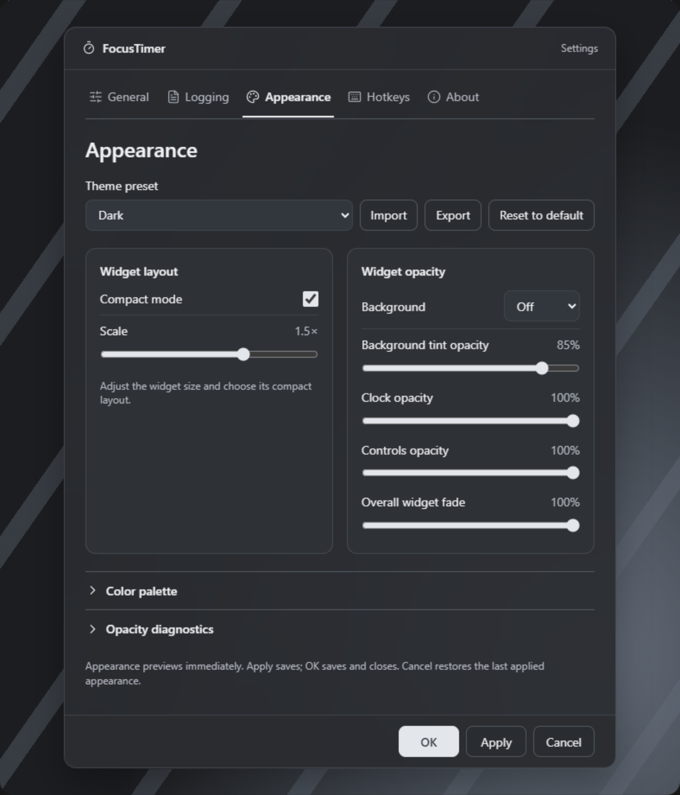

## Authoritative navigation reference

Source: user-uploaded `Screenshot 2026-10-05 164734.jpg`. Use its outlined icons, text labels, common baseline, active underline, and selected weight. Its colors and custom-looking header do not require palette changes or replacement native window decorations.

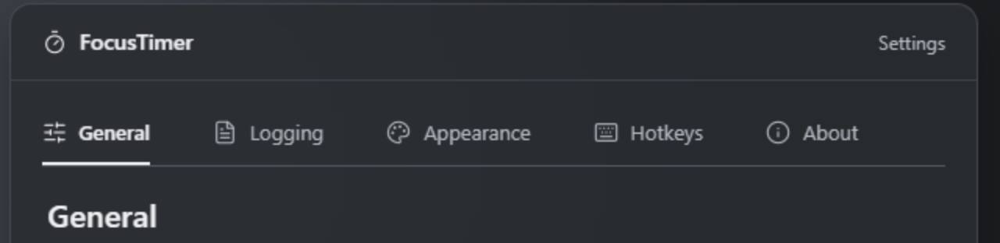

## Selected alternatives

These snapshots record the selected choices from the earlier three-option comparison. They isolate each choice; the combined compositions above resolve the full target. Prototype values and helper copy are illustrative. The application's existing control inventory and bindings remain authoritative.

| Choice | Screenshot | Decision |
|---|---|---|
| Dense frost | [View](selected/dense-frost.png) | Near-solid tint, subtle depth, sharp foreground, native verification and solid fallback |
| Compact rows | [View](selected/compact-rows.png) | Default layout for settings and editors |
| Grouped cards | [View](selected/grouped-cards.png) | Use only for two or more meaningful peer groups; rows remain compact inside |
| Native clarity | [View](selected/native-clarity.png) | Segoe UI desktop typography; widget font remains unchanged |
| Soft rounded | [View](selected/soft-rounded.png) | Moderate, consistent control radii and state styling |
| Icon-and-underline tabs | [Uploaded reference](navigation-user-reference.jpg) | Labeled outlined icons, thin baseline, active underline |

## Original application screenshots

Source: the ten images in the uploaded `FocusTimer-screenshots.zip`. These are unchanged baseline images, not new implementation captures. Some baseline controls predate current behavior; source and existing specifications determine which settings are retained.

| Screenshot | Relevant issue | Proposed treatment |
|---|---|---|
| [Settings — General](baseline/settings-general.png) | Tall tab blocks, uneven section/row spacing, mixed control geometry | Compact sections, shared fonts/controls, icon underlines |
| [Settings — Logging](baseline/settings-logging.png) | Path/actions crowd the form; rule fields lose their identity after watermarks disappear | Aligned rows, flexible path/action layout, persistent rule labels |
| [Settings — Appearance](baseline/settings-appearance.png) | Many controls compete for hierarchy; long opacity labels clip | Theme tools, two peer cards, palette disclosures, flexible label/control rows |
| [Settings — Hotkeys](baseline/settings-hotkeys.png) | Read-only fields lack the same visual hierarchy as other pages | Consistent labeled read-only fields; editing remains out of scope |
| [Settings — About](baseline/settings-about.png) | Inconsistent content spacing and developer-control grouping | Clear app information and compact Developer sections |
| [Worklog — Entries](baseline/worklog-entries.png) | Toolbar/navigation/control styling differs from Settings | Shared shell, typography, tabs, toolbar, and editor controls; table structure retained |
| [Worklog — Timeline](baseline/worklog-timeline.png) | Dense data needs separation from surrounding chrome | Near-solid readable content with shared window chrome; timeline behavior retained |
| [Worklog — Summary](baseline/worklog-summary.png) | Heading, selector, and value presentation need shared hierarchy | Shared typography/control styling; existing grouping and proportional reporting retained |
| [Widget — Expanded](baseline/widget-expanded.png) | Relevant boundary for avoiding shared-style regressions | Preserve layout, fonts, controls, opacity behavior, and Off/Solid choices |
| [Widget — Compact](baseline/widget-compact.png) | Compact controls could be affected by broad selectors | Preserve widget-specific styles and existing accessible targets |

### Settings baseline images

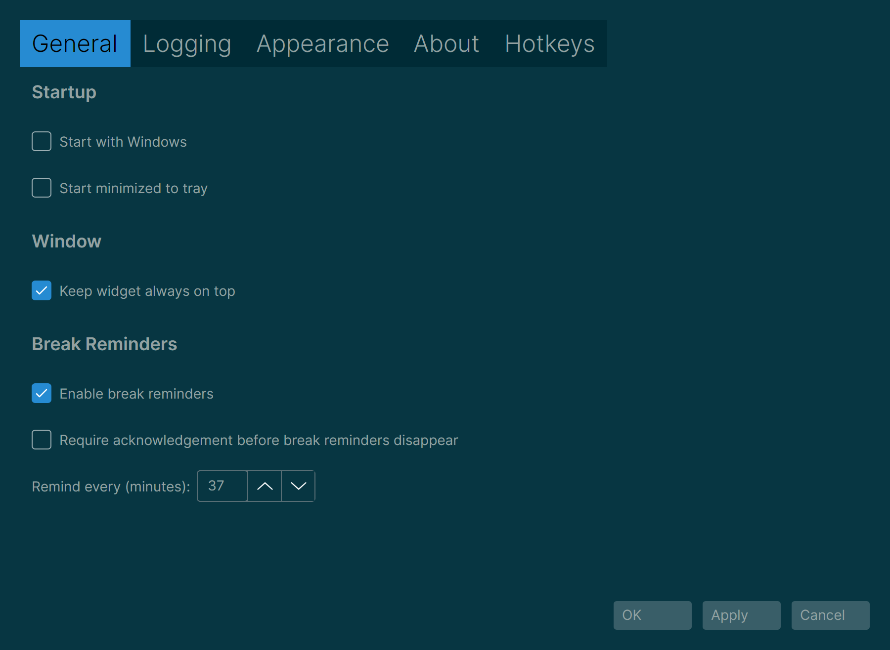

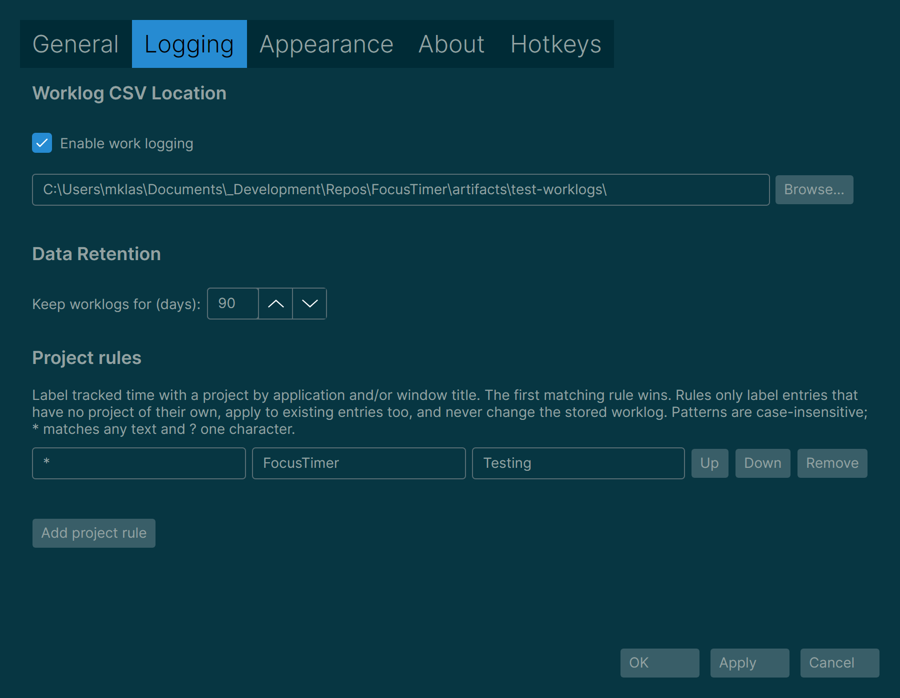

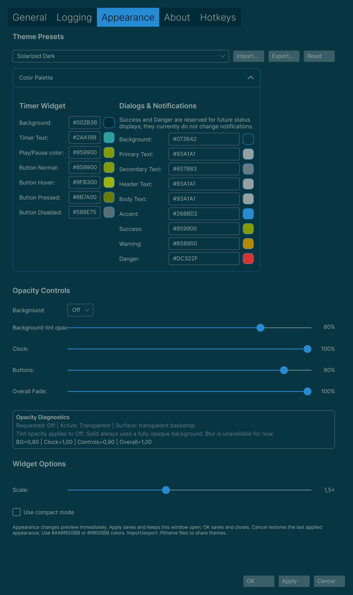

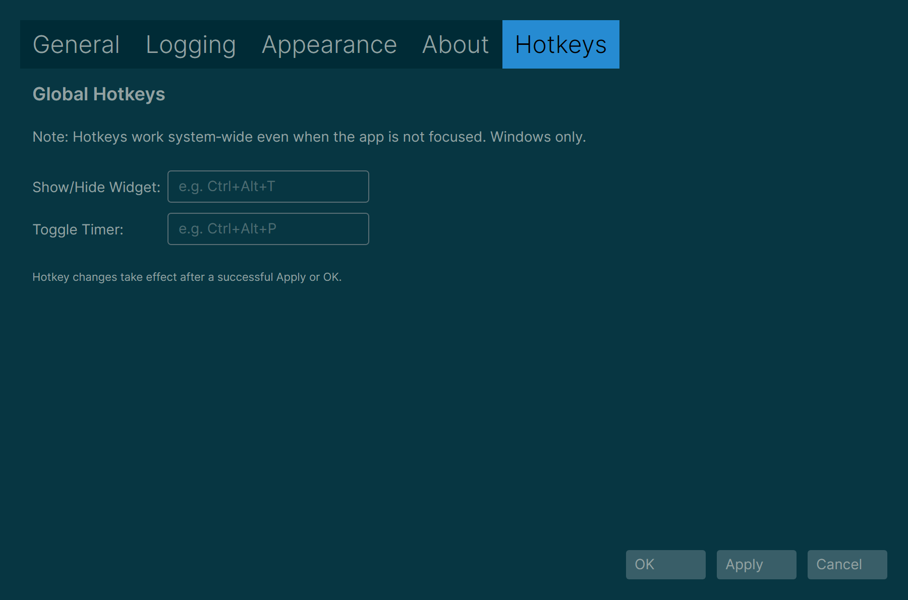

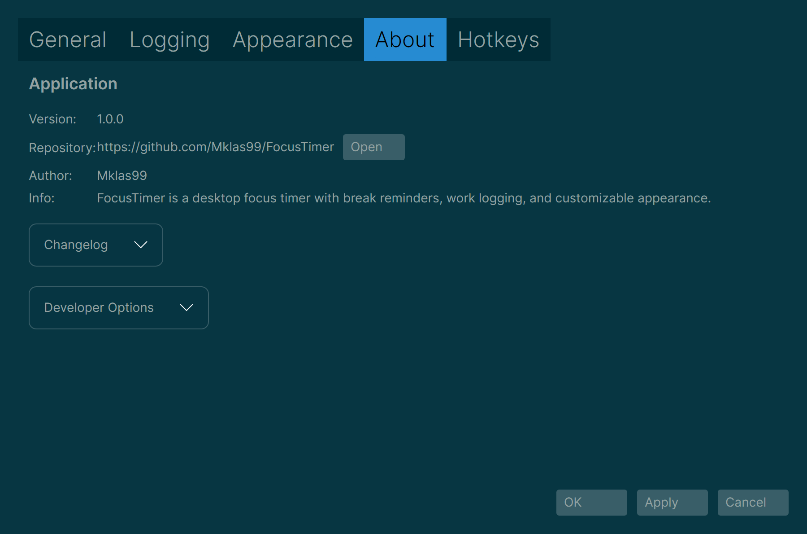

### Worklog baseline images

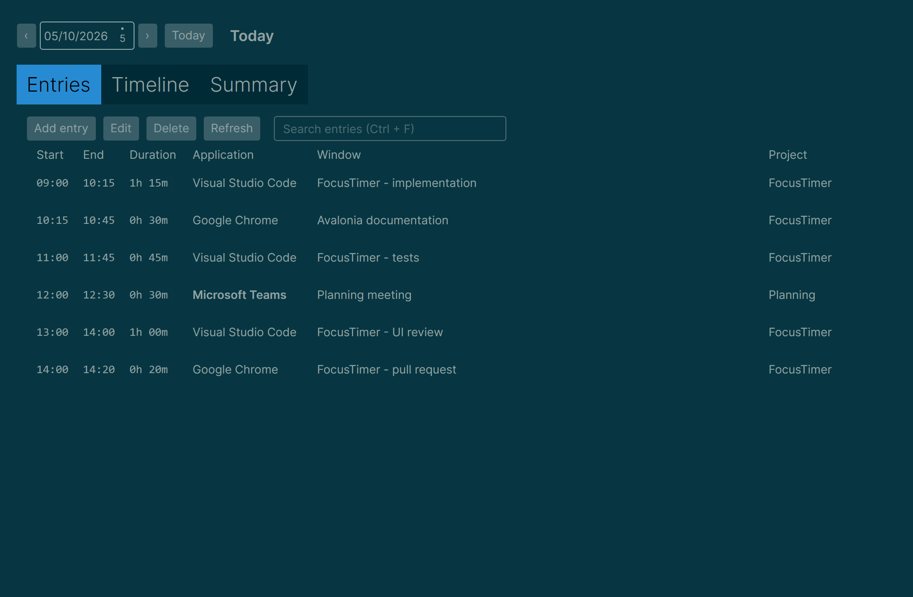

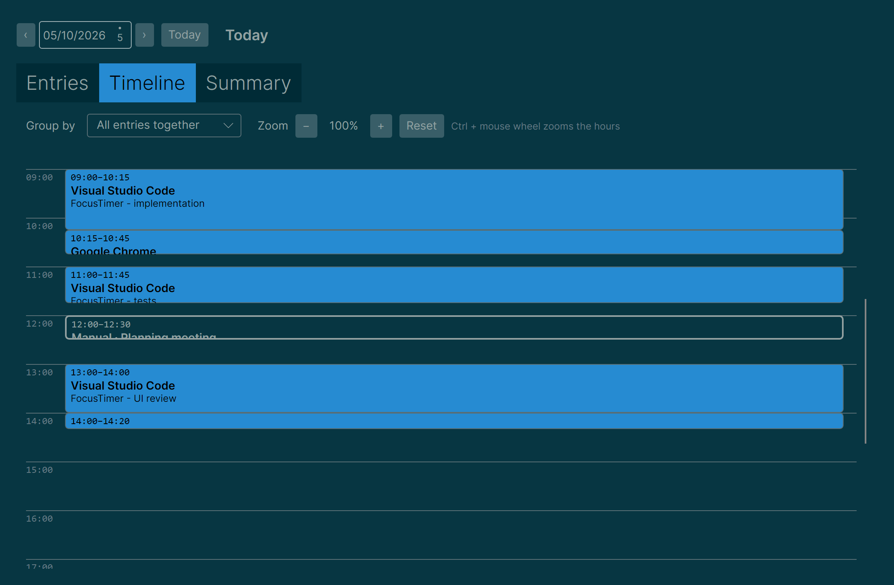

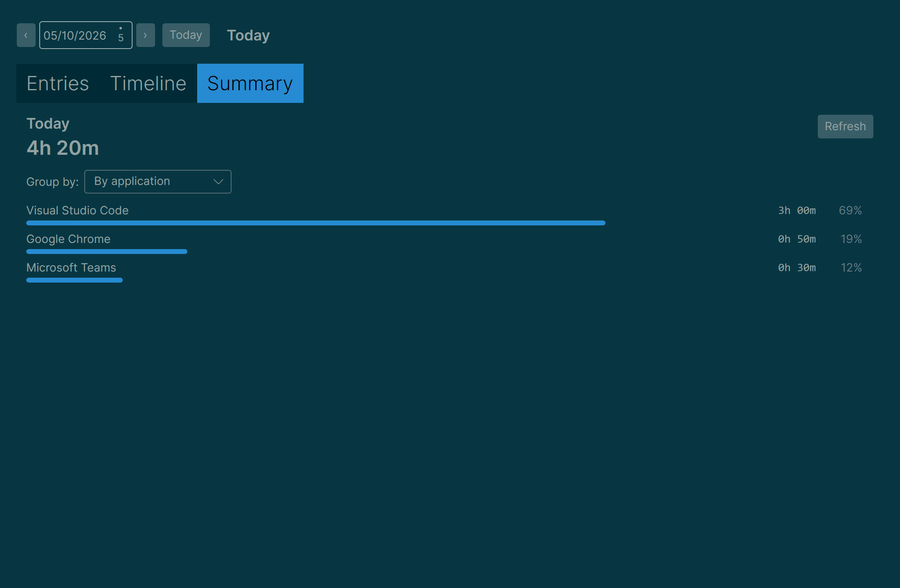

### Widget regression boundaries

